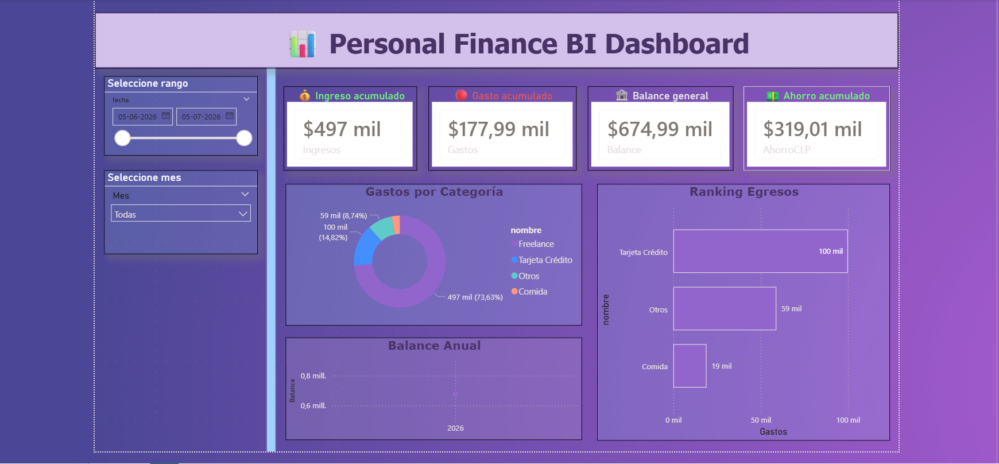

# 📊 Personal Finance BI Dashboard ✨

> Turning financial data into insights — with code, analytics, and a little girl power 💖  

---

# 🇺🇸 English

## 🚀 Overview

End-to-end Business Intelligence project designed to automate personal financial tracking and reporting.

This solution integrates form-based data collection, API ingestion, relational database storage, and interactive analytics dashboards.

---

## 🛠 Tech Stack

- 📝 Google Forms
- ⚙️ Google Apps Script
- 🐍 Python
- 🌐 Flask API
- 🗄️ Microsoft SQL Server
- 📊 Power BI
- 🔗 ngrok

---

## 🏗 Architecture

```text
Google Form
   ↓
Apps Script
   ↓
Python API
   ↓
SQL Server
   ↓
Power BI Dashboard
```

---

## ✨ Features

- Automated financial data capture
- API-based ingestion
- SQL data persistence
- Interactive BI dashboard
- Savings KPI tracking
- Monthly balance analysis
- Expense category insights

---

## 📸 Dashboard Preview



---

# 🗣 Spanish

## 🚀 Descripción

Proyecto de Business Intelligence de punta a punta diseñado para automatizar el registro, almacenamiento y análisis de finanzas personales.

La solución integra captura de datos mediante formularios, ingestión vía API, almacenamiento en base de datos relacional y visualización interactiva.

---

## 🛠 Tecnologías utilizadas

- 📝 Google Forms
- ⚙️ Google Apps Script
- 🐍 Python
- 🌐 Flask API
- 🗄️ Microsoft SQL Server
- 📊 Power BI
- 🔗 ngrok

---

## ✨ Funcionalidades

- Captura automatizada de movimientos financieros
- Integración vía API
- Persistencia de datos en SQL Server
- Dashboard interactivo
- KPI de ahorro
- Balance mensual
- Análisis por categoría de gastos

---

## 📂 Estructura del proyecto

```text
personal-finance-bi-dashboard/
├── api/
├── sql/
├── powerbi/
├── screenshots/
└── README.md
```

---

## 💖 Author Astrid Coy

Built with curiosity, consistency, and confidence.  
